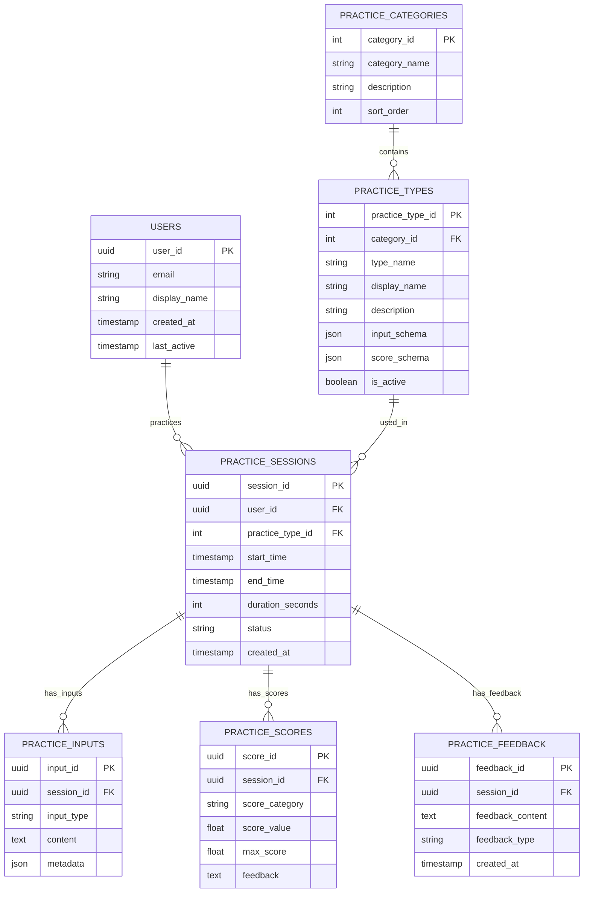

# 医学部採用試験対策アプリ - データベースリファクタリング計画書

## 🎯 プロジェクト概要

現在のSupabaseデータベース設計を、PostgreSQLの特性を活かしたリレーショナルデータベースに適切に再設計し、Streamlit Cloud環境での履歴表示問題を解決する。

## 📋 現在の問題点

### 1. テーブル設計の問題
- **practice_type列**: 文字列で複雑な情報を格納（例：「過去問スタイル採用試験 - Letter形式（翻訳 + 意見）」）
- **inputs列**: JSONB型で、練習タイプごとに異なる構造が混在
- **正規化不足**: 練習タイプ、カテゴリ、サブカテゴリが正規化されていない
- **拡張性の欠如**: 新しい練習タイプや評価項目の追加が困難

### 2. Streamlit Cloud環境での問題
- セッションID管理により、実際にデータがあっても履歴が表示されない
- セッションIDが毎回新規生成される可能性
- ユーザーの継続的な学習履歴が追跡できない

### 3. データ整合性とメンテナンス性
- 練習タイプの文字列がハードコーディングされている
- スコア構造が一貫していない
- 統計・分析機能の拡張が困難

## 🏗️ 新しいデータベース設計

### ERD（Entity Relationship Diagram）



### テーブル詳細設計

#### 1. users テーブル
```sql
CREATE TABLE users (
    user_id UUID PRIMARY KEY DEFAULT gen_random_uuid(),
    email VARCHAR(255) UNIQUE,
    display_name VARCHAR(100),
    preferences JSONB DEFAULT '{}',
    created_at TIMESTAMP WITH TIME ZONE DEFAULT NOW(),
    last_active TIMESTAMP WITH TIME ZONE DEFAULT NOW()
);
```

#### 2. practice_categories テーブル
```sql
CREATE TABLE practice_categories (
    category_id SERIAL PRIMARY KEY,
    category_name VARCHAR(50) NOT NULL UNIQUE,
    display_name VARCHAR(100) NOT NULL,
    description TEXT,
    icon VARCHAR(20),
    sort_order INTEGER DEFAULT 0,
    is_active BOOLEAN DEFAULT true
);
```

#### 3. practice_types テーブル
```sql
CREATE TABLE practice_types (
    practice_type_id SERIAL PRIMARY KEY,
    category_id INTEGER REFERENCES practice_categories(category_id),
    type_name VARCHAR(100) NOT NULL UNIQUE,
    display_name VARCHAR(150) NOT NULL,
    description TEXT,
    input_schema JSONB DEFAULT '{}',
    score_schema JSONB DEFAULT '{}',
    sort_order INTEGER DEFAULT 0,
    is_active BOOLEAN DEFAULT true,
    created_at TIMESTAMP WITH TIME ZONE DEFAULT NOW()
);
```

#### 4. practice_sessions テーブル
```sql
CREATE TABLE practice_sessions (
    session_id UUID PRIMARY KEY DEFAULT gen_random_uuid(),
    user_id UUID REFERENCES users(user_id),
    practice_type_id INTEGER REFERENCES practice_types(practice_type_id),
    theme VARCHAR(200),
    start_time TIMESTAMP WITH TIME ZONE DEFAULT NOW(),
    end_time TIMESTAMP WITH TIME ZONE,
    duration_seconds INTEGER,
    status VARCHAR(20) DEFAULT 'in_progress', -- 'in_progress', 'completed', 'abandoned'
    metadata JSONB DEFAULT '{}',
    created_at TIMESTAMP WITH TIME ZONE DEFAULT NOW()
);
```

#### 5. practice_inputs テーブル
```sql
CREATE TABLE practice_inputs (
    input_id UUID PRIMARY KEY DEFAULT gen_random_uuid(),
    session_id UUID REFERENCES practice_sessions(session_id) ON DELETE CASCADE,
    input_type VARCHAR(50) NOT NULL, -- 'question', 'answer', 'translation', 'opinion', etc.
    content TEXT,
    metadata JSONB DEFAULT '{}',
    created_at TIMESTAMP WITH TIME ZONE DEFAULT NOW()
);
```

#### 6. practice_scores テーブル
```sql
CREATE TABLE practice_scores (
    score_id UUID PRIMARY KEY DEFAULT gen_random_uuid(),
    session_id UUID REFERENCES practice_sessions(session_id) ON DELETE CASCADE,
    score_category VARCHAR(50) NOT NULL, -- '臨床的正確性', '実践的思考', etc.
    score_value DECIMAL(5,2) NOT NULL,
    max_score DECIMAL(5,2) NOT NULL DEFAULT 10.00,
    feedback TEXT,
    created_at TIMESTAMP WITH TIME ZONE DEFAULT NOW()
);
```

#### 7. practice_feedback テーブル
```sql
CREATE TABLE practice_feedback (
    feedback_id UUID PRIMARY KEY DEFAULT gen_random_uuid(),
    session_id UUID REFERENCES practice_sessions(session_id) ON DELETE CASCADE,
    feedback_content TEXT NOT NULL,
    feedback_type VARCHAR(20) DEFAULT 'general', -- 'general', 'improvement', 'strong_point'
    ai_model VARCHAR(50),
    created_at TIMESTAMP WITH TIME ZONE DEFAULT NOW()
);
```

## 🔄 移行戦略

### フェーズ1: 設計・準備段階
1. 新しいテーブル構造の詳細設計
2. データ移行スクリプトの作成
3. 新しいDatabaseManagerクラスの実装

### フェーズ2: 段階的移行
1. 新しいテーブル作成（既存テーブルと並行運用）
2. 既存データの新テーブルへの移行
3. アプリケーションコードの段階的更新

### フェーズ3: 最終移行・検証
1. 本格運用開始
2. 既存テーブルの削除
3. パフォーマンスチューニング

## 🎯 期待される効果

### 1. データ構造の改善
- 正規化により、データの一貫性と整合性が向上
- 新しい練習タイプの追加が容易
- 統計・分析機能の大幅な拡張が可能

### 2. Streamlit Cloud対応
- ユーザーベースの履歴管理で、セッション間の継続性を確保
- 複数デバイスからの学習履歴統合
- より安定した履歴表示

### 3. 拡張性・保守性
- スキーマベースの入力・スコア管理
- 新機能追加時の影響範囲最小化
- コードの可読性・保守性向上

## 📝 次のステップ

1. **詳細設計書の作成**: 各テーブルのより詳細な仕様
2. **マイグレーションスクリプト**: 既存データの移行手順
3. **新DatabaseManagerの実装**: リファクタリングされたデータアクセス層
4. **ユーザー認証機能**: Streamlit Cloud環境でのユーザー識別
5. **テスト計画**: 移行前後の動作検証手順 