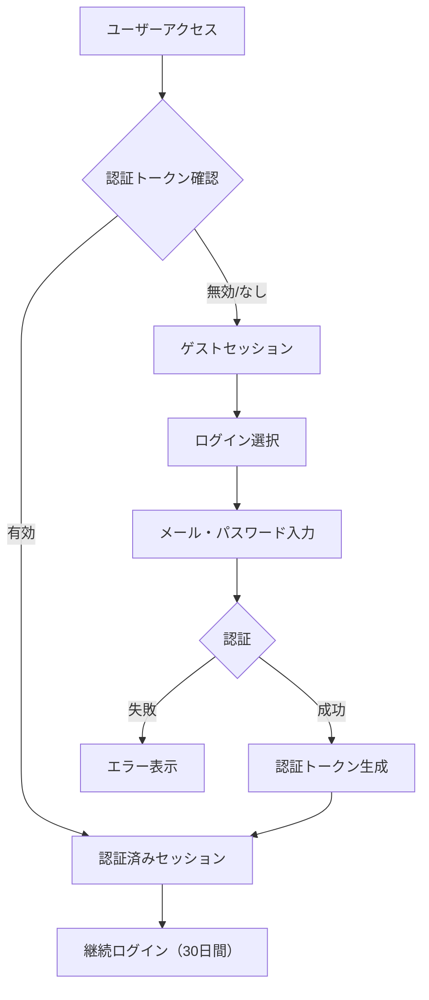

# ユーザー管理機能セットアップガイド

## 🎯 概要

医学部採用試験対策アプリに包括的なユーザー管理機能が追加されました。パスワードベース認証、プロフィール管理、学習設定、成果システムなど、充実した機能でユーザー体験を大幅に向上させます。

## ✨ 新機能一覧

### 🔐 認証システム
- **ユーザー登録**: メールアドレス・パスワードでの新規登録
- **ログイン・ログアウト**: セキュアな認証システム
- **パスワード管理**: 強度チェック、変更機能
- **セッション管理**: 最大30日間の継続ログイン
- **セキュリティ**: アカウントロック、ログイン試行制限

### 👤 プロフィール管理
- **基本情報**: 氏名、表示名、自己紹介
- **設定**: タイムゾーン、言語、アバター
- **アカウント状態**: アクティブ・非アクティブ管理
- **プライバシー**: 公開範囲設定

### ⚙️ 学習設定システム
- **学習目標**: 日次・週次練習目標、目標スコア設定
- **通知設定**: メール通知、リマインダー、成果通知
- **学習設定**: 難易度、ヒント表示、タイマー機能
- **UI設定**: テーマ、フォントサイズ、レイアウト
- **プライバシー**: データ利用、統計表示設定

### 🏆 成果・バッジシステム
- **バッジ獲得**: 練習達成による成果獲得
- **ポイントシステム**: 学習モチベーション向上
- **成果統計**: 獲得バッジ数、合計ポイント表示
- **成果履歴**: 獲得日時、詳細情報

### 📊 統合セッション管理
- **マルチ認証**: パスワード・メール・フィンガープリント対応
- **継続性**: デバイス間での学習履歴同期
- **セキュリティ**: 安全なトークン管理
- **ゲストモード**: 登録なしでも基本機能利用可能

## 🚀 セットアップ手順

### ステップ1: Supabaseスキーマの適用

**重要**: データ損失を防ぐため、必ず事前にバックアップを取ってください。

```sql
-- 1. Supabaseダッシュボードにアクセス
-- 2. プロジェクト → Database → SQL Editor を開く
-- 3. 以下のファイルの内容を順番に実行

-- 基本スキーマ（まだ実行していない場合）
-- docs/supabase_schema_setup.sql

-- ユーザー管理機能拡張（新規実行）
-- docs/supabase_user_management_schema.sql
```

### ステップ2: アプリケーションの再起動

```bash
# アプリケーションを再起動
uv run streamlit run app.py
```

### ステップ3: 動作確認

1. **ユーザー登録テスト**
   - 「ユーザー管理」ページから新規登録
   - パスワード強度チェックの動作確認
   - ログイン・ログアウトの動作確認

2. **設定機能テスト**
   - プロフィール編集の動作確認
   - 学習設定の保存・読み込み確認
   - パスワード変更機能の確認

3. **継続ログイン確認**
   - ブラウザを閉じて再度開く
   - セッションが維持されているか確認

## 📋 機能詳細

### 🔐 認証フロー



### 👤 ユーザー情報管理

**保存される情報**:
- **基本情報**: メール、氏名、表示名、自己紹介
- **認証情報**: パスワードハッシュ、ログイン履歴
- **設定情報**: 学習目標、通知設定、UI設定
- **成果情報**: 獲得バッジ、ポイント、統計
- **アクティビティ**: ログイン・ログアウト・設定変更履歴

### 🛡️ セキュリティ機能

1. **パスワードセキュリティ**
   - PBKDF2暗号化（10万回反復）
   - 32バイトランダムソルト
   - 強度チェック（大文字・小文字・数字・特殊文字）

2. **アカウント保護**
   - 5回ログイン失敗でアカウントロック（30分間）
   - セッショントークンの自動期限管理
   - アクティビティログによる不正アクセス検知

3. **データ保護**
   - Row Level Security (RLS)
   - ユーザー毎のデータ分離
   - 暗号化されたトークン管理

## 🎮 使用方法

### 新規ユーザー登録

1. **ホームページ**の「🔐 ログイン」ボタンをクリック
2. **「新規登録」**タブを選択
3. **必要情報を入力**:
   - メールアドレス
   - 氏名・表示名
   - パスワード（8文字以上、複雑性要件あり）
   - 利用規約への同意
4. **「登録」**ボタンでアカウント作成
5. **ログイン**してサービス利用開始

### ログイン・ログアウト

**ログイン**:
- メールアドレスとパスワードを入力
- 「ログイン」ボタンをクリック
- 自動的にマイページに移動

**ログアウト**:
- サイドバーの「ログアウト」ボタン
- または「ユーザー管理」ページのログアウトボタン

### プロフィール・設定管理

1. **「ユーザー管理」**ページにアクセス
2. **各タブで設定変更**:
   - 📊 学習統計: 学習状況の確認
   - 🏆 成果・バッジ: 獲得バッジの表示
   - ⚙️ 設定: 学習目標・通知・UI設定
   - ✏️ プロフィール編集: 基本情報・パスワード変更

### 学習目標設定

1. **「ユーザー管理」** → **「設定」**タブ
2. **学習目標セクション**で設定:
   - 1日の練習目標数（1-10回）
   - 1週間の練習目標数（1-50回）
   - 目標スコア（5.0-10.0）
   - 練習時間帯（朝・午後・夜・いつでも）
3. **「設定を保存」**で完了

## 🔄 既存機能との連携

### 学習履歴の統合

- **認証ユーザー**: 永続的な学習履歴保存
- **ゲストユーザー**: セッション中のみ履歴保存
- **データ移行**: ゲスト→認証ユーザーへの履歴移行

### セッション管理の改善

**認証優先順位**:
1. パスワード認証（最優先）
2. セッショントークン
3. メールベース認証
4. ブラウザフィンガープリント
5. フォールバック（一時セッション）

### UIの統合

- **ホームページ**: ユーザー状態に応じた表示
- **全ページ**: 統一されたユーザー状態表示
- **サイドバー**: セッション情報・クイックアクセス
- **ナビゲーション**: ログイン状態に応じた案内

## 📊 管理・監視

### データベース管理関数

```sql
-- ユーザー統計更新
SELECT update_user_statistics();

-- 期限切れトークンクリーンアップ
SELECT cleanup_expired_tokens();

-- アカウントロック解除
SELECT unlock_user_account('user@example.com');
```

### 統計・分析ビュー

- **user_profile_view**: ユーザープロフィール統合ビュー
- **user_achievements_summary**: 成果サマリービュー
- **active_users_stats**: アクティブユーザー統計

## ⚠️ 注意事項

### セキュリティ

1. **本番環境では**:
   - メール認証を有効化
   - HTTPS通信を必須に
   - 定期的なバックアップ実施

2. **パスワードポリシー**:
   - 最低8文字以上
   - 大文字・小文字・数字・特殊文字を含む
   - 一般的なパスワードは使用不可

### データ管理

1. **プライバシー**:
   - ユーザーデータは最小限に
   - 不要になったデータは削除
   - GDPR等の規制に準拠

2. **バックアップ**:
   - 定期的なデータベースバックアップ
   - 重要な変更前の手動バックアップ
   - 復旧手順の文書化

## 🚀 今後の拡張計画

### 予定機能

1. **ソーシャル機能**:
   - 友達登録・グループ学習
   - 学習状況の共有
   - リーダーボード

2. **高度な分析**:
   - 学習パターン分析
   - AI推奨システム
   - 個別学習プラン

3. **通知システム**:
   - メール通知の実装
   - プッシュ通知
   - 学習リマインダー

### 技術的改善

1. **パフォーマンス**:
   - キャッシュシステム
   - データベース最適化
   - 非同期処理

2. **セキュリティ**:
   - 二要素認証
   - OAuth連携
   - 監査ログ強化

## 📞 サポート

### トラブルシューティング

**よくある問題**:

1. **ログインできない**
   - パスワードの確認
   - アカウントロック状態の確認
   - ブラウザキャッシュのクリア

2. **設定が保存されない**
   - データベース接続の確認
   - 権限設定の確認
   - エラーログの確認

3. **セッションが切れる**
   - トークンの有効期限確認
   - ブラウザの設定確認
   - クッキーの有効化確認

### 技術サポート

**ログ確認**:
```bash
# Streamlitログの確認
streamlit run app.py --logger.level debug

# データベースログの確認
# Supabaseダッシュボード → Logs
```

**開発者向け情報**:
- コードベース: `modules/user_auth.py`, `modules/session_manager.py`
- データベーススキーマ: `docs/supabase_user_management_schema.sql`
- UI統合: `app.py`, `pages/07_ユーザー管理.py`

---

## 🎉 まとめ

包括的なユーザー管理機能により、医学部採用試験対策アプリはより魅力的で使いやすいサービスに進化しました。ユーザーは安全で継続的な学習環境を得られ、管理者は詳細な分析とセキュアな運営が可能になります。

**主な成果**:
- ✅ セキュアな認証システム
- ✅ 包括的なプロフィール管理
- ✅ 柔軟な学習設定システム
- ✅ モチベーション向上の成果システム
- ✅ 既存機能との完全統合
- ✅ 拡張性の高いアーキテクチャ

今すぐセットアップして、新しいユーザー体験をお楽しみください！🚀 